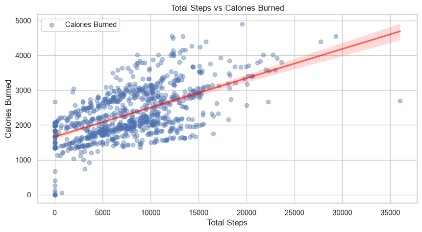
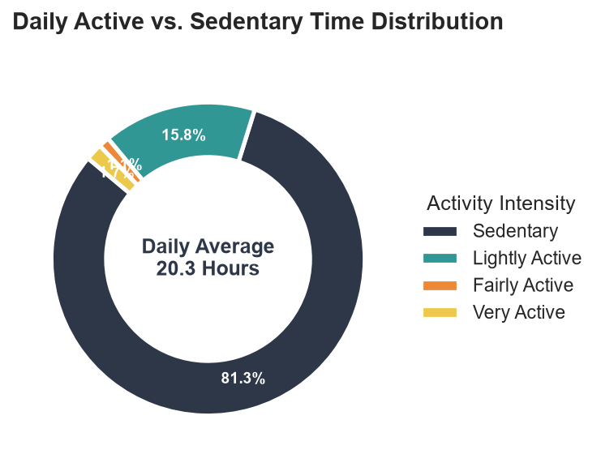
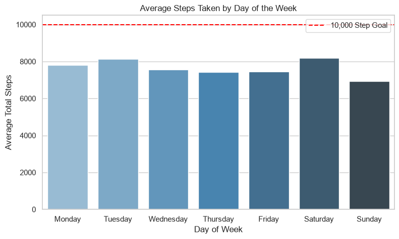
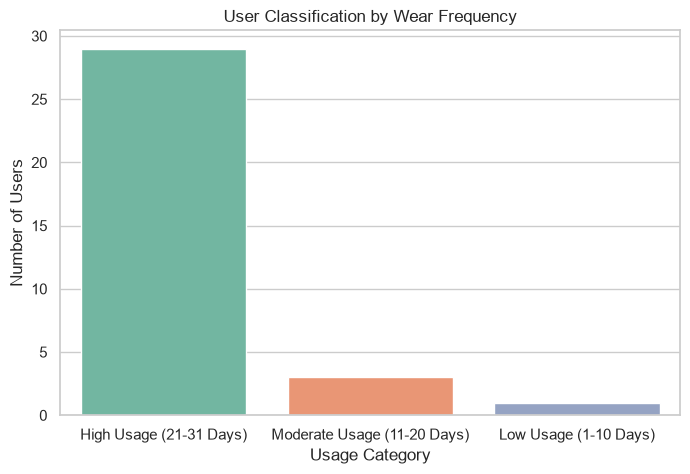

# Fitbit Fitness & Sleep Data Analysis

An exploratory data analysis (EDA) and interactive web dashboard analyzing daily activity levels, caloric expenditure, wear habits, and sleep patterns using Python.

---

## Highlights
- **Integrated Data Sources**: Combined daily tracking metrics (`dailyActivity_merged.csv`) with sleep logs (`sleepDay_merged.csv`) across unique user IDs and dates.
- **Data Hygiene**: Handled datetime conversions, schema alignment, and mean-value imputation for missing sleep tracking days.
- **Interactive Visualization**: Built a Streamlit & Plotly dashboard to analyze user performance, activity distribution, and sleep efficiency.
- **Behavioral Segmentation**: Classified users by wear frequency and daily activity intensity to generate actionable health and marketing insights.

---

## Data Visualizations & Key Insights

### 1. Total Steps vs. Calories Burned

* **Insight**: Strong positive correlation between daily step volume and calories burned. High-intensity active minutes significantly accelerate energy output.

### 2. Daily Active Minutes Breakdown

* **Insight**: Sedentary time makes up the majority of daily tracking logs, highlighting a clear opportunity for automated inactivity alerts and periodic movement prompts.

### 3. Average Steps Taken by Day of the Week

* **Insight**: Identifies day-by-day activity fluctuations throughout the week, helping pinpoint specific days where user engagement dips.

### 4. User Classification by Wear Frequency

* **Insight**: Categorizes participants based on tracking consistency (High, Fair, or Low wear frequency) to evaluate long-term device retention and habit formation.

---

## Project Structure
```text
├── data/
│   ├── dailyActivity_merged.csv
│   ├── sleepDay_merged.csv
│   └── merged_fitbit_data.csv                  # Processed clean dataset
├── notebooks/
│   └── bellabeat.ipynb                         # Exploratory analysis & data pipeline
├── Visualizations/                             # Saved chart exports
│   ├── average_steps_taken_by_day_of_the_week.png
│   ├── daily_active_donut_chart.png
│   ├── total_steps_vs_calories_burned.png
│   └── user_classification_by_wear_frequency.png
├── app.py                                      # Interactive Streamlit web dashboard
├── requirements.txt                            # Python dependencies
└── README.md
